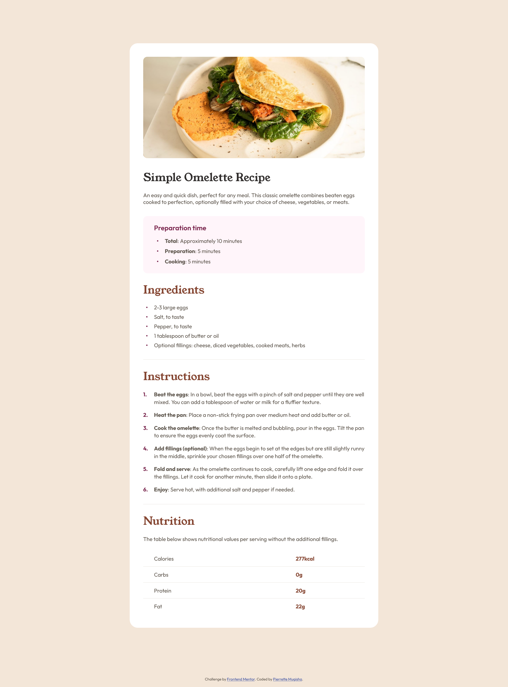

# Frontend Mentor - Recipe page solution

This is a solution to the [Recipe page challenge on Frontend Mentor](https://www.frontendmentor.io/challenges/recipe-page-KiTsR8QQKm). Frontend Mentor challenges help you improve your coding skills by building realistic projects.

## Table of contents

- [Overview](#overview)
  - [The challenge](#the-challenge)
  - [Screenshot](#screenshot)
  - [Links](#links)
- [My process](#my-process)
  - [Built with](#built-with)
  - [Useful resources](#useful-resources)
- [Author](#author)

## Overview

### Screenshot

### Links

- Solution URL: [Solution URL](https://github.com/pierrettemugisha/fm-recipe-page)
- Live Site URL: [Live site URL](https://vercel.com/pierrettemugishas-projects/fm-recipe-page)

## My process

### Built with

- Semantic HTML5 markup
- CSS custom properties
- Flexbox

### Useful resources

- [W3 Schools - HTML Tutorial](https://www.w3schools.com/html/) - This helped me for basic HTML. This is my go to resource for all things development. It's a good start for learning the basics of a programing language in general.
- [W3 Schools - CSS Tutorial](https://www.w3schools.com/css/default.asp) - This helped me for CSS. I find CSS very hard. This is will still be my go-to resource if I am struggling with something else.

## Author

- Github - [Github Profile](https://github.com/pierrettemugisha)
- Frontend Mentor - [@pierrettemugisha](https://www.frontendmentor.io/profile/pierrettemugisha)
